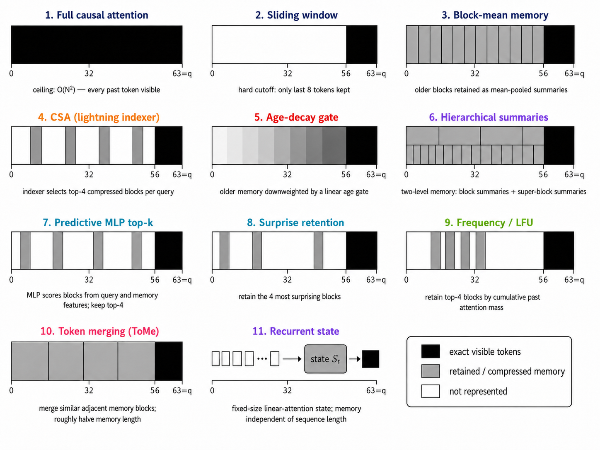

# Forgetting Attention (遗忘注意力)

**语言 (Language)**: [English](README.md) | 中文

十种遗忘与记忆注意力策略 (forgetting and memory attention policies) 的纯 PyTorch 参考实现 (reference implementation),
配有正确性测试 (correctness tests)、可复现的单 GPU 扫描 (one-GPU sweep),以及一篇简短的论文。



黑色 (black) 区域是查询 (query) 可以完整访问的部分,灰色 (gray) 区域是通过记忆或门控 (memory/gating) 保留下来的部分,白色 (white) 区域是被遗忘的部分。

## 论文 (Paper)

- **PDF (中文)**: [paper_zh.pdf](paper_zh.pdf)
- **PDF (English)**: [paper.pdf](paper.pdf)
- **源文件 (Source, 中文)**: [docs/research/reports/arch_compare_20260526_zh.tex](docs/research/reports/arch_compare_20260526_zh.tex)
- **源文件 (Source, English)**: [docs/research/reports/arch_compare_20260526.tex](docs/research/reports/arch_compare_20260526.tex)
- **最终图表与结果表 (Final plots and results table)**: [docs/research/results/forgetting_scaling_latest](docs/research/results/forgetting_scaling_latest)

## 用 AI 代理上手 (Onboard with an AI agent)

把下面这段提示词粘贴到 Claude Code、Cursor 或任何能跑 shell 的代理 (agent) 里。它会自动配好环境、下载数据,并把项目情况介绍给你。

```text
Clone https://github.com/vukrosic/forgetting-attention into the current directory.
Create a Python venv, install requirements.txt, and download the dataset
(see the "Data" section of the README). Then read the paper source at
docs/research/reports/arch_compare_20260526.tex along with the implementations
under models/ (especially models/layers.py, models/memory_policies.py,
models/new_forgetting.py, models/compressed_sparse_attention.py), the sweep at
experiments/forgetting_scaling_sweep.py, and the correctness suite at
tests/test_forgetting_mechanisms.py. Ignore anything listed in docs/STALE.md.
Then tell me:
  1. what the project is about
  2. what each of the ten forgetting mechanisms does, in one sentence each,
     with the file:line where it is defined
  3. what the preliminary results say and what they do not say
  4. the main limitations of the current setup
  5. the most promising next experiments
Then ask me which experiment I want to run first.
```

## 策略 (Policies)

点击任一类名 (class name) 即可直接跳转到对应的实现。

| 策略 (Policy) | 思想 (Idea) | 实现 (Implementation) |
|---|---|---|
| `dense` | 完整因果 SDPA (full causal SDPA),基线 (baseline)。 | [`MultiHeadAttention`](models/layers.py#L45) |
| `local` | 滑动窗口 (sliding window),不带记忆。 | [`LocalSlidingWindowAttention`](models/layers.py#L131) |
| `csa` | DeepSeek 风格的索引器 (indexer) 选 top-k 个压缩块 (compressed blocks)。 | [`CompressedSparseAttention`](models/compressed_sparse_attention.py#L193) |
| `compressed_memory` | 对旧 token 做块均值摘要 (block-mean summaries)。 | [`CompressedMemoryNoGateAttention`](models/memory_policies.py#L607) |
| `age_forgetting` | 在压缩块上施加线性年龄衰减门 (linear age-decay gate)。 | [`AgeForgettingAttention`](models/memory_policies.py#L332) |
| `hierarchical` | 块 + 块的摘要 (summaries of summaries),分层 (hierarchical)。 | [`HierarchicalSummarizationAttention`](models/memory_policies.py#L801) |
| `predictive` | 学习到的路由器 (learned router) 按查询选块。 | [`PredictiveImportanceAttention`](models/memory_policies.py#L919) |
| `surprise_retention` | 保留最难从自身键预测出来的块 (surprising blocks)。 | [`SurpriseRetentionAttention`](models/new_forgetting.py#L41) |
| `frequency_lfu` | 保留过去拿到注意力质量 (attention mass) 多的块。 | [`FrequencyLFUAttention`](models/new_forgetting.py#L158) |
| `token_merge` | 合并相邻相似的记忆块 (memory blocks),即 token 合并 (token merging)。 | [`TokenMergeAttention`](models/new_forgetting.py#L273) |
| `recurrent_state` | 固定大小的线性注意力累加器 (linear-attention accumulator)。 | [`RecurrentStateAttention`](models/new_forgetting.py#L437) |

`models/` 下不被本文使用的其他模块 (遗留版本 legacy、探索性的注意力 exploratory attentions) 列在 [docs/STALE.md](docs/STALE.md)。

## 安装 (Install)

```bash
python3 -m venv .venv
source .venv/bin/activate
pip install -r requirements.txt
```

如果要跑 CUDA,请在跑扫描 (sweep) 之前安装与你 GPU 环境匹配的 PyTorch 版本。

## 数据 (Data)

```bash
python3 - <<'PY'
from datasets import load_dataset
from pathlib import Path
out = Path("processed_data/speedrun_40M")
out.mkdir(parents=True, exist_ok=True)
ds = load_dataset("vukrosic/blueberry-1B-pretrain", split="train[:20000]")
ds.save_to_disk(str(out))
PY
```

## 测试 (Tests)

```bash
python -m tests.test_forgetting_mechanisms
```

会在所有 11 个策略上检查形状/数据类型 (shape/dtype)、因果性 (causality)、遮蔽正确性 (mask correctness)、梯度流 (gradient flow) 与峰值显存 (peak memory)。

## 复现扫描 (Reproduce the sweep)

```bash
bash scripts/run_gpu_sweep.sh
```

在单张 CUDA GPU 上跑 11 个策略 × 3 个上下文长度 (2K/4K/8K) × 每个 300 秒。输出写到 `runs/forgetting_scaling/<timestamp>/`。重新生成图表与顶层的 `paper.pdf` / `paper_zh.pdf`:

```bash
python experiments/forgetting_scaling_plot.py \
  runs/forgetting_scaling/<timestamp> \
  --out docs/research/results/forgetting_scaling_latest

cd docs/research/reports
pdflatex -interaction=nonstopmode arch_compare_20260526.tex
pdflatex -interaction=nonstopmode arch_compare_20260526.tex
cp arch_compare_20260526.pdf ../../../paper.pdf

xelatex -interaction=nonstopmode arch_compare_20260526_zh.tex
xelatex -interaction=nonstopmode arch_compare_20260526_zh.tex
cp arch_compare_20260526_zh.pdf ../../../paper_zh.pdf
```

## 已知的局限 (Known limits)

单一随机种子 (one seed)、单一数据集、18M 参数级别的模型、300 秒的运行、未融合的 PyTorch (unfused PyTorch)、普通的下一 token 预测 (next-token prediction) 任务。下一个有用的实验是一个合成的长距离检索基准 (long-range retrieval benchmark),其中查询必须从数千 token 之前的位置恢复出对应的值。
