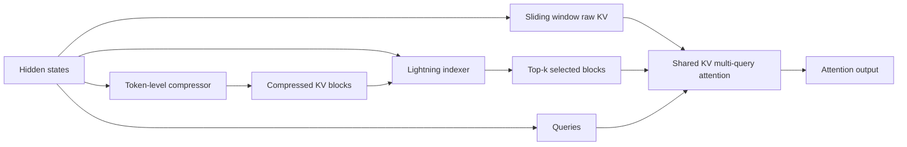

# Build DeepSeek V4's Compressed Sparse Attention

This tutorial takes you from the idea to a working implementation to a real research
experiment.

By the end, you should understand why vanilla attention breaks at million-token
context, how Compressed Sparse Attention (CSA) changes the scaling, where CSA fits
inside this repository, and how to change one variable and measure whether your
change helped.

## Can GitHub Render This?

Yes, but with one important distinction.

GitHub renders Markdown files directly in the repository view, including images and
Mermaid diagrams. That makes `docs/tutorial.md` the best default format for a
readable tutorial.

GitHub can also render real HTML as a website through GitHub Pages, which hosts
HTML, CSS, and JavaScript from a repository as a static site:

<https://docs.github.com/en/pages/getting-started-with-github-pages/about-github-pages>

So the practical rule is:

- Use Markdown for the repo tutorial people read on GitHub.
- Use GitHub Pages if you want `tutorial.html` to open as a polished web page.

---

## Before Level 1: What Is A Token?

Before CSA makes sense, one beginner idea has to click:

> A language model does not read text as sentences, words, or letters. It reads
> text as **tokens**.

A token is a small chunk produced by the model's tokenizer. Sometimes it is a
whole word. Sometimes it is part of a word. Sometimes it is punctuation.

For example:

| Text | Possible tokens |
| --- | --- |
| `Coffee and news early.` | `Coffee` `and` `news` `early` `.` |
| `refrigerator` | `refrig` `erator` |
| `I'm coding.` | `I` `'m` `coding` `.` |
| `GPU-optimized` | `GPU` `-` `optimized` |

Different tokenizers split text differently, so the exact pieces can change.
The important idea is stable:

```text
text -> tokens -> vectors -> attention
```

Each token becomes a vector, which is just a list of numbers the model can do
math on. Attention does not compare raw words. It compares these token vectors.

### A Tiny Token Story

Suppose the model reads this short day log:

```text
Coffee and news early. Gym for an hour.
Code all afternoon long. Called mom this evening.
```

For teaching, imagine it becomes 16 tokens:

| Block | Tokens |
| --- | --- |
| Block 1 | `Coffee` `and` `news` `early.` |
| Block 2 | `Gym` `for` `an` `hour.` |
| Block 3 | `Code` `all` `afternoon` `long.` |
| Block 4 | `Called` `mom` `this` `evening.` |

With normal attention, the model stores one key and one value for every token.
That means 16 token positions create 16 key/value entries. A future query has
to compare against all of them.

Small example:

```text
16 tokens -> 16 KV entries
```

Long-context reality:

```text
1,000,000 tokens -> 1,000,000 KV entries
```

That is the wall CSA is trying to avoid.

### How CSA Compresses Tokens

Compressed Sparse Attention groups old tokens into blocks. If the block size is
`m = 4`, the 16-token example becomes four blocks:

```text
[Coffee and news early.] [Gym for an hour.]
[Code all afternoon long.] [Called mom this evening.]
```

Then the compressor turns each block into one summary vector:

| Raw token block | Human shorthand for the compressed vector |
| --- | --- |
| `Coffee` `and` `news` `early.` | `morning: coffee + news` |
| `Gym` `for` `an` `hour.` | `midday: workout` |
| `Code` `all` `afternoon` `long.` | `afternoon: coding` |
| `Called` `mom` `this` `evening.` | `evening: family call` |

Those labels are only for us. Inside the model, the summaries are still vectors,
not English phrases. The important shape is:

```text
16 token vectors
        |
        | compress every m = 4 tokens
        v
4 summary vectors
```

So every old token still contributes to the context, but it contributes through
a smaller number of learned summaries.

CSA then asks a cheaper question:

```text
Which summary blocks matter for this query?
```

Instead of forcing every query to inspect every old token, CSA selects a few
relevant summaries with `top_k`. It also keeps a recent sliding window of raw
tokens, because the newest text often needs exact detail.

That is the beginner mental model:

```text
old history       -> compressed summaries
recent history    -> raw tokens
current query     -> picks useful summaries + reads recent raw tokens
```

The rest of the tutorial turns that idea into code.

---

## Level 1: Understand

### The problem: every query looks at every key

Vanilla self-attention has a brutally simple contract:

1. Store one key and one value for every token.
2. For each query token, compare it against every previous key.
3. Use the resulting weights to mix the values.

That is elegant, but it scales badly.

Memory grows linearly because every token adds another KV entry. Compute grows
quadratically because every query touches every key.

At short context lengths, this is fine. At one million tokens, it becomes the
main bottleneck.


The measured curve above is only a single-head probe on this Mac, but the shape
is the important part. As context doubles, the late-stage runtime gets close to
4x larger. That is the signature of quadratic attention.

If we extrapolate that same curve toward one million tokens, the picture gets
ugly fast:


The KV cache creates a separate wall. Even before training activations or model
weights, a million-token KV cache can be too large for a normal machine:


CSA exists to avoid this wall.

### The core idea

Compressed Sparse Attention says:

> Compress old tokens into summary blocks, select only the most relevant blocks
> for each query, and always keep a small local window of recent raw tokens.

Instead of a query attending to all `N` previous tokens, it attends to:

```text
selected compressed history + recent sliding window
```

The three main knobs are:

- `m`: compression block size.
- `top_k`: number of compressed blocks selected per query.
- `w`: sliding window size for recent raw tokens.

For example, if `m = 8`, `top_k = 4`, and `w = 16`, each query uses information
from roughly `4 * 8 + 16 = 48` raw-token equivalents, not the entire sequence.

That is the whole bet: most queries do not need every old token. They need a few
relevant old regions plus precise recent context.



### The paper compressor in plain English

Pages 9-11 of the DeepSeek V4 paper define the CSA core.

First, the compressor creates two content streams and two weight streams from
the hidden states:

```text
C_a = H W_aKV
C_b = H W_bKV
Z_a = H W_aZ
Z_b = H W_bZ
```

For compressed block `i`, it combines:

- `m` entries from the current `C_a` block.
- `m` entries from the previous `C_b` block.
- learnable position biases for both streams.

Then it softmaxes over those `2m` positions and returns one compressed entry.

In words:

> Each compressed entry is a learned weighted summary of the current block and
> the previous block.

The first block has no previous block, so the previous side is masked out.

That overlap is important. It lets neighboring compressed entries share boundary
information instead of chopping the context into hard, isolated chunks.

### Sparse selection

Once we have compressed blocks, the Lightning Indexer scores which old blocks a
query should look at.

For each query token:

1. Project the query into a smaller latent query vector.
2. Expand that latent into several small indexer heads.
3. Compare those heads against compressed indexer keys.
4. Use `top_k` to keep only the strongest compressed blocks.

Then CSA performs attention over:

```text
local sliding-window KV + selected compressed KV
```

This is why CSA can get much cheaper without becoming blind to recent text.


The chart above shows the teaching result: CSA attends to far fewer tokens per
query while still producing a similar output.

When `top_k` increases, the output approaches vanilla attention:


This shape matters. It tells you CSA is tunable. You can spend more compute for
more fidelity, or spend less compute for more speed and memory savings.

---

## Level 2: Implement

The baseline model in this repo is `MinimalLLM`. The dense baseline attention
lives in:

```text
models/layers.py
```

CSA is implemented as a separate opt-in path, so you can compare it against the
baseline without destroying the original model.

### Implementation map

```text
configs/csa_config.py
models/compressed_sparse_attention.py
tests/test_compressed_sparse_attention.py
docs/compressed_sparse_attention.md
```

Inside `models/compressed_sparse_attention.py`:

- `TokenCompressor` implements equations 9-12.
- `LightningIndexer` implements equations 13-17.
- `CompressedSparseAttention` wires compression, sparse selection, sliding window,
  shared KV MQA, and output projection together.
- `GroupedOutputProjection` implements the grouped projection described on page 11.

The original baseline stays available:

```bash
python train_llm.py --attention_impl dense
```

CSA is selected explicitly:

```bash
python train_llm.py \
  --attention_impl csa \
  --csa_compression_block_size 16 \
  --csa_top_k 8 \
  --csa_sliding_window_size 64 \
  --csa_indexer_heads 4 \
  --csa_output_groups 1
```

### The coding-agent prompt

If you want to reproduce this from scratch with a coding agent, paste this:

```text
You are in a PyTorch LLM repo with a working dense Transformer baseline.

Implement DeepSeek V4 Compressed Sparse Attention from pages 9-11 of the paper.
Keep the dense baseline untouched and make CSA an opt-in attention implementation.

Requirements:
- Add a CSA config object with knobs for compression block size m, top_k, sliding
  window size, indexer heads, query compression dim, indexer dim, output groups,
  and group hidden dim.
- Implement a TokenCompressor matching equations 9-12:
  two content streams C_a/C_b, two weight streams Z_a/Z_b, learnable position
  biases, softmax over 2m entries, previous-block masking for i=0, and one
  compressed entry per block.
- Implement a LightningIndexer matching equations 13-17:
  low-rank query latent, indexer query heads, learned per-head scalar weights,
  ReLU score, causal compressed-block masking, and top-k selection.
- Implement shared key-value MQA over local sliding-window KV plus selected
  compressed KV.
- Implement grouped output projection from page 11.
- Wire CSA into the Transformer block behind attention_impl="csa".
- Keep attention_impl="dense" as the default.
- Add CPU tests for compressor math, causal top-k selection, forward/backward
  gradients, and tiny-model integration.
- Add short docs explaining where the implementation lives and how to run it.

Do not add custom CUDA kernels yet. Use plain PyTorch first so the math is easy
to inspect and test. Optimize later only after correctness is established.
```

### What to test before training

Do not start with a giant training run. First prove the module is sane.

Run:

```bash
/Users/vukrosic/miniconda3/bin/python -m unittest discover -s tests
```

The current test suite checks four things:

1. The compressor matches the paper's overlapped current/previous block behavior.
2. The indexer cannot select future compressed blocks.
3. CSA has finite gradients on CPU.
4. `MinimalLLM` can instantiate and run with `attention_impl="csa"`.

That does not prove CSA is fast. It proves the implementation is shaped correctly
before you spend GPU time.

### What is intentionally not solved yet

This repo currently implements the research version in clear PyTorch. It does
not include the custom sparse CUDA kernels DeepSeek uses for real speed at
million-token context.

That is the right order:

1. Match the math.
2. Add tests.
3. Run small training experiments.
4. Only then optimize kernels.

---

## Level 3: Change One Thing And Measure It

This is where the tutorial becomes real AI research.

You are no longer just copying a paper. You are changing one architectural choice,
holding the rest fixed, and measuring whether the change improves the tradeoff.

### The first serious experiment: sweep `top_k`

Keep everything fixed except `top_k`.

Run the same short training or evaluation job with:

```text
top_k = 1, 2, 4, 8, 16
```

Record:

- validation loss
- tokens per second
- peak GPU memory
- wall-clock time
- final perplexity
- CSA selected-token budget per query

Use one table:

| Run | top_k | Val loss | Tokens/sec | Peak VRAM | Notes |
| --- | ---: | ---: | ---: | ---: | --- |
| baseline | dense | | | | full attention |
| csa-1 | 1 | | | | most compressed |
| csa-2 | 2 | | | | |
| csa-4 | 4 | | | | |
| csa-8 | 8 | | | | |
| csa-16 | 16 | | | | highest fidelity |

The question is not "which run wins every metric?"

The real question is:

> Where is the knee of the curve where CSA gets most of the quality back while
> still saving a lot of memory and compute?

That is a research question.

### A stronger experiment: change the compressor

Once `top_k` works, change exactly one thing in `TokenCompressor`.

Good first changes:

- Increase or decrease `compression_block_size`.
- Change `query_compression_dim`.
- Change `indexer_dim`.
- Try more or fewer `indexer_heads`.
- Try grouped output projection with `output_groups > 1`.

Do not change five things at once. If the run improves, you will not know why.

Use this rule:

```text
one idea -> one config change -> one measurement table
```

### Example research prompt for the agent

After the baseline CSA implementation is working, use a coding agent like this:

```text
Run a controlled CSA experiment.

Keep model size, data, seed, optimizer, training tokens, and batch size fixed.
Change only csa_top_k across 1, 2, 4, 8, and 16.

For each run, save:
- exact command
- git commit or diff hash
- config values
- validation loss
- tokens/sec
- peak GPU memory if available
- wall-clock time
- metrics JSON path

Write a short report in docs/experiments/top_k_sweep.md with a table, one chart,
and a recommendation for the next experiment.
```

That prompt turns "I implemented a paper" into "I ran an experiment."

### What makes this frontier-adjacent

DeepSeek V4's CSA is not just a coding trick. It is an architectural tradeoff:

- compress old context so memory stops exploding
- select sparse old blocks so compute stops exploding
- preserve recent raw tokens so local detail does not disappear
- tune the budget so the model stays useful

When you change `top_k`, `m`, or the compressor dimension and measure quality vs
memory, you are exploring the same design space frontier labs care about:

```text
How much context can a model use before attention becomes too expensive?
```

The first version does not need to beat DeepSeek. It needs to be honest:

- one change
- one metric table
- one conclusion
- one next question

That is the loop.

## Done Checklist

- You can explain why vanilla attention has a million-token wall.
- You can describe CSA in one sentence.
- You know where the baseline dense attention lives.
- You know where this repo's CSA implementation lives.
- You can run the CPU tests before touching a GPU.
- You can launch a dense run and a CSA run with different CLI flags.
- You have one concrete research experiment: sweep `top_k`, measure the curve,
  and decide the next change.

## Three Quick Questions

1. Why does CSA keep a sliding window of raw recent tokens instead of compressing
   everything?
2. What does increasing `top_k` usually buy you, and what does it cost?
3. If CSA gets a lower validation loss but uses more memory than expected, what
   is the next measurement you should inspect?
