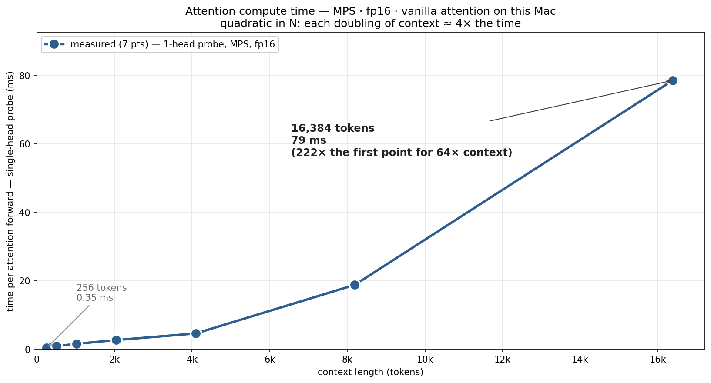
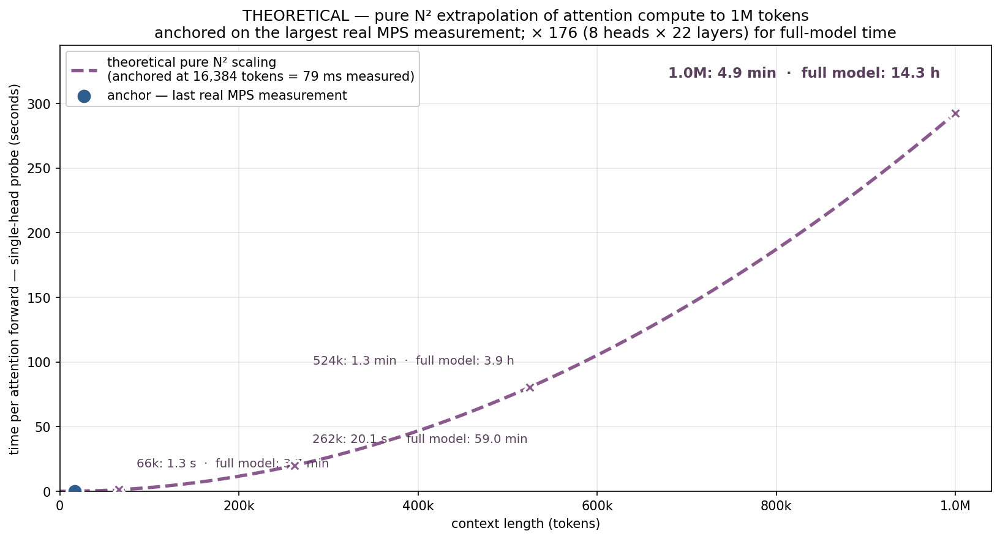
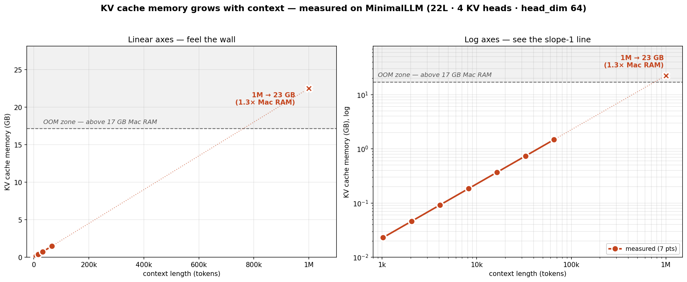
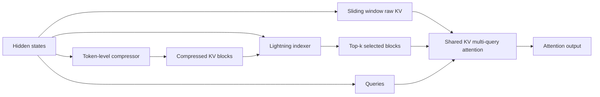
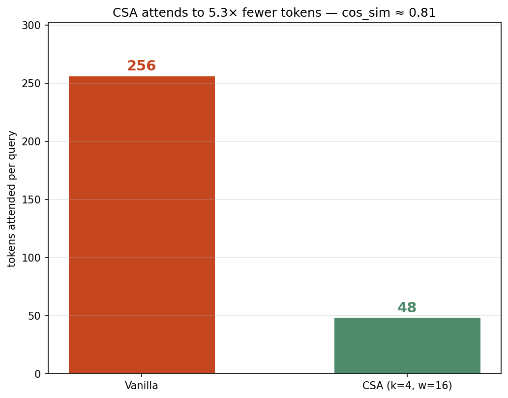
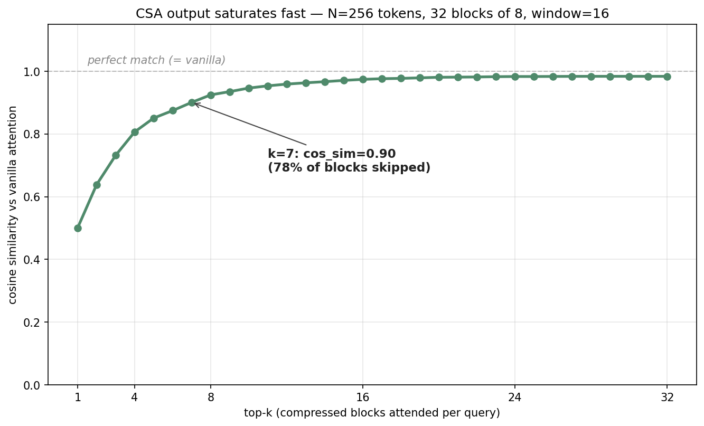

# Build DeepSeek V4's Compressed Sparse Attention

This tutorial takes you from the idea to a working implementation to a real research
experiment.

By the end, you should understand why vanilla attention breaks at million-token
context, how Compressed Sparse Attention (CSA) changes the scaling, where CSA fits
inside this repository, and how to change one variable and measure whether your
change helped.

You will learn how DeepSeek makes LLM 10x faster.

We will understand DeepSeek’s Compressed Sparse Attention, then implement it from paper, and lastly do our own new research. After watching this you will have full understanding be able to continue producing cutting edge research on CSA.

---

## Level 0: Quick Token Reminder

An LLM does not see a paragraph as one big object. It first splits text into
tokens, then turns those tokens into vectors.

For example, this sentence:

```text
Coffee and news early.
```

might become tokens like:

```text
[Coffee] [and] [news] [early] [.]
```

Real tokenizers differ. A token can be a word, part of a word, punctuation, or
even whitespace. The exact split is not the point here. The point is:

```text
text -> tokens -> vectors -> attention
```

Attention is how the current token takes information from previous tokens. If
the model is predicting what comes next, it can look back and ask: which earlier
tokens matter right now?

CSA changes that lookup. Instead of making the current token inspect every old
token directly, it compresses older tokens into summary blocks, then attends to
the most relevant summaries plus a small window of recent raw tokens.

Tiny picture:

```text
[Coffee] [and] [news] [early]   [Gym] [for] [an] [hour]
            |                                |
            v                                v
     [morning summary]              [workout summary]
```

Those summary labels are just human shorthand. Inside the model, each summary is
still a vector.

Important detail: the compressed summary is usually the same width as the vector
attention wants to read. It is not smaller because the vector has fewer numbers.
It is smaller because there are fewer vectors:

```text
8 old token vectors -> 1 compressed summary vector
```

In this repo, the main compressed KV summary has width `head_dim`, the same width
as one attention key/value vector. The separate indexer can use a smaller width
called `indexer_dim`, because its only job is to choose which blocks to read.

CSA is asking: can we keep enough information while making the model look at
fewer things?

---

## Level 1: Understand

### The problem: every query looks at every key

Vanilla self-attention has a brutally simple contract:

1. Take the current token.
2. Compare it against the previous tokens.
3. Pull information from the previous tokens that seem most useful.

This article assumes you have seen attention before, so this is only a reminder.

Here is the mental image:

```text
current token:   [today]

previous tokens: [Coffee] [and] [news] [early] [Gym] [for] [an] [hour]
                     ^                         ^
                     useful earlier context    less useful right now
```

The current token sends out a query: "what previous information helps me right
now?" Every previous token has a key, which is like a label the query can match
against. Every previous token also has a value, which is the information the
model can copy into the current token after it decides what matters.

Implementation detail: transformers store previous-token information as keys
and values, often abbreviated as `KV`.

```text
query asks:  "is this previous token useful?"
key answers: "this is what I am about"
value says:  "this is the information you can take from me"
```

That is elegant, but it scales badly.

Memory grows linearly because every token adds another stored key/value entry.
Compute grows quadratically because every query touches every previous key.

At short context lengths, this is fine. At one million tokens, it becomes the
main bottleneck.



As context doubles, the late-stage runtime gets close to
4x larger. That is the signature of quadratic attention.

If we extrapolate that same curve toward one million tokens, the picture gets
ugly fast:



The KV cache creates a separate wall.

During generation, the model does not want to recompute keys and values for all
old tokens again and again. So it stores them in memory. That stored table is
the KV cache.

Simple picture:

```text
token 1 -> key vector + value vector
token 2 -> key vector + value vector
token 3 -> key vector + value vector
...
token N -> key vector + value vector
```

Every extra token adds another pair of vectors. At a million tokens, even before
training activations or model weights, that table can be too large for a normal
machine:



CSA exists to avoid this wall.

### The core idea

Compressed Sparse Attention says:

> Compress old tokens into summary blocks.

Then, for each query:

> Select only the most relevant old summaries, and always keep a small local
> window of recent raw tokens.

Instead of a query attending to all `N` previous tokens, it attends to:

```text
selected compressed history + recent sliding window
```

Compressed history:

```text
old tokens:
[A1] [A2] [A3] [A4]   [B1] [B2] [B3] [B4]   [C1] [C2] [C3] [C4]
        |                       |                       |
        v                       v                       v
   [summary A]             [summary B]             [summary C]

query reads: [summary A] and [summary C]
```

Recent sliding window:

```text
old compressed summaries ...        recent raw tokens
[summary A] [summary B] [summary C] [t-3] [t-2] [t-1] [t]
                                      ^^^^^^^^^^^^^^^^^^^^^
                                      kept exactly
```

The three main knobs are:

- `m`: compression block size.
- `top_k`: number of compressed blocks selected per query.
- `w`: sliding window size for recent raw tokens.

For example, if `m = 8`, `top_k = 4`, and `w = 16`, each query uses information
from roughly `4 * 8 + 16 = 48` raw-token equivalents, not the entire sequence.

That is the whole bet: most queries do not need every old token. They need a few
relevant old regions plus precise recent context.



### The paper compressor in plain English

Pages 9-11 of the DeepSeek V4 paper define the CSA core.

First, use friendly names:

```text
current_values  = information from this block
previous_values = information from the previous block
current_scores  = how much to trust each current-block token
previous_scores = how much to trust each previous-block token
```

The paper writes those four streams as:

```text
C_a = H W_aKV
C_b = H W_bKV
Z_a = H W_aZ
Z_b = H W_bZ
```

Line by line:

- `H` is the hidden-state table, one vector per token.
- `W_aKV` turns each token into a current-block value vector.
- `W_bKV` turns each token into a previous-block value vector.
- `W_aZ` creates current-block scores.
- `W_bZ` creates previous-block scores.

The letters are ugly, but the operation is simple: make candidate information,
make scores for that information, softmax the scores, and take a weighted sum.
For compressed block `i`, it combines:

- `m` entries from the current `C_a` block.
- `m` entries from the previous `C_b` block.
- learnable position biases for both streams.

Then it softmaxes over those `2m` positions and returns one compressed entry.

In words:

> Each compressed entry is a learned weighted summary of the current block and
> the previous block.

The first block has no previous block, so the previous side is masked out.

That overlap is important. It lets neighboring compressed entries share boundary
information instead of chopping the context into hard, isolated chunks.

### Sparse selection

Once we have compressed blocks, the Lightning Indexer scores which old blocks a
query should look at.

For each query token:

1. Project the query into a smaller latent query vector.
2. Expand that latent into several small indexer heads.
3. Compare those heads against compressed indexer keys.
4. Use `top_k` to keep only the strongest compressed blocks.

Then CSA performs attention over:

```text
local sliding-window KV + selected compressed KV
```

This is why CSA can get much cheaper without becoming blind to recent text.



The chart above shows the teaching result: CSA attends to far fewer tokens per
query while still producing a similar output.

When `top_k` increases, the output approaches vanilla attention:



This shape matters. It tells you CSA is tunable. You can spend more compute for
more fidelity, or spend less compute for more speed and memory savings.

---

## Level 2: Implement

Now we turn the idea into the repo implementation.

The baseline model is `MinimalLLM`. The original dense attention lives in
`models/layers.py`, and it stays the default. CSA lives beside it as an opt-in
research path:

```text
configs/csa_config.py
models/compressed_sparse_attention.py
models/layers.py
models/llm.py
train_llm.py
tests/test_compressed_sparse_attention.py
```

The implementation order is:

1. Add research knobs.
2. Implement the token compressor.
3. Implement the sparse block selector.
4. Attend over selected compressed history plus recent raw tokens.
5. Wire it into the model without deleting dense attention.
6. Test shapes, causality, gradients, and model integration.

### Step 1: Add Research Knobs

Before writing attention code, make the experiment configurable.

The config object is small on purpose:

```python
@dataclass
class CSAConfig:
    compression_block_size: int = 16
    top_k: int = 8
    sliding_window_size: int = 64
    indexer_heads: int = 4
    query_compression_dim: Optional[int] = None
    indexer_dim: Optional[int] = None
    output_groups: int = 1
    group_hidden_dim: Optional[int] = None
```

Line by line:

- `compression_block_size` is `m`, the number of old tokens compressed into one
  summary.
- `top_k` is how many old summary blocks each query may read.
- `sliding_window_size` is `w`, the number of recent raw tokens kept exactly.
- `indexer_heads` controls how many small scoring heads the indexer uses.
- `query_compression_dim` is the low-rank query size used by the indexer.
- `indexer_dim` is the width of the compressed vectors used only for block
  selection.
- `output_groups` and `group_hidden_dim` control the grouped output projection
  from page 11 of the paper.

Why this matters: CSA is not one fixed trick. It is a family of tradeoffs. These
knobs let us ask research questions later, like "what happens if `top_k` is 4
instead of 8?"

### Step 2: Build The Token Compressor

The compressor is the first real CSA component.

Input:

```text
hidden states H: one vector per token
```

Output:

```text
compressed entries: one summary vector per block
```

The friendly formula is:

```text
current_values  = H @ W_current_value
previous_values = H @ W_previous_value

current_scores  = H @ W_current_score  + current_position_bias
previous_scores = H @ W_previous_score + previous_position_bias

weights = softmax([current_scores, previous_scores])

summary_i =
    weighted_sum(current block values)
  + weighted_sum(previous block values)
```

Line by line:

- `current_values` are the candidate information from the current block.
- `previous_values` are the candidate information from the previous block.
- `current_scores` decide which current-block tokens matter.
- `previous_scores` decide which previous-block tokens matter.
- `softmax` turns scores into weights that add up to 1.
- `summary_i` is one compressed vector for block `i`.

The previous block is included because hard block boundaries are ugly. If block
2 begins right after an important sentence started in block 1, the block-2
summary should still be able to see that boundary context.

The actual module starts like this:

```python
class TokenCompressor(nn.Module):
    def __init__(self, d_model: int, out_dim: int, block_size: int):
        super().__init__()
        self.d_model = d_model
        self.out_dim = out_dim
        self.block_size = block_size

        self.a_value = nn.Linear(d_model, out_dim, bias=False)
        self.b_value = nn.Linear(d_model, out_dim, bias=False)
        self.a_weight = nn.Linear(d_model, out_dim, bias=False)
        self.b_weight = nn.Linear(d_model, out_dim, bias=False)
        self.a_position_bias = nn.Parameter(torch.zeros(block_size, out_dim))
        self.b_position_bias = nn.Parameter(torch.zeros(block_size, out_dim))
```

Line by line:

- `d_model` is the width of the normal hidden state.
- `out_dim` is the width of each compressed summary.
- `block_size` is `m`.
- `a_value` makes current-block value vectors.
- `b_value` makes previous-block value vectors.
- `a_weight` makes current-block scores.
- `b_weight` makes previous-block scores.
- The two position biases let the compressor learn that token position inside a
  block matters.

Now the forward pass:

```python
c_a = self._pad_tokens(self.a_value(hidden_states), pad_len)
c_b = self._pad_tokens(self.b_value(hidden_states), pad_len)
z_a = self._pad_tokens(self.a_weight(hidden_states), pad_len)
z_b = self._pad_tokens(self.b_weight(hidden_states), pad_len)

c_a = c_a.view(batch_size, num_blocks, block_size, self.out_dim)
c_b = c_b.view(batch_size, num_blocks, block_size, self.out_dim)
z_a = z_a.view(batch_size, num_blocks, block_size, self.out_dim)
z_b = z_b.view(batch_size, num_blocks, block_size, self.out_dim)
```

Line by line:

- `c_a` and `c_b` are candidate value vectors.
- `z_a` and `z_b` are candidate score vectors.
- `_pad_tokens` makes the sequence length divisible by `block_size`.
- `.view(...)` reshapes the sequence into blocks, so the tensor now has a block
  axis.

Then we shift the previous-block stream:

```python
prev_c_b = torch.zeros_like(c_b)
prev_z_b = torch.zeros_like(z_b)
if num_blocks > 1:
    prev_c_b[:, 1:] = c_b[:, :-1]
    prev_z_b[:, 1:] = z_b[:, :-1]
```

Line by line:

- `prev_c_b` is empty at first.
- `prev_z_b` is empty at first.
- For block 1 and later, copy the previous block into the current position.
- Block 0 has no previous block, so it stays zero and gets masked.

Finally, score, softmax, and sum:

```python
score_a = z_a + self.a_position_bias.view(1, 1, block_size, self.out_dim)
score_b = prev_z_b + self.b_position_bias.view(1, 1, block_size, self.out_dim)
scores = torch.cat([score_a, score_b], dim=2)

scores = scores.masked_fill(
    ~masks.view(1, num_blocks, 2 * block_size, 1),
    torch.finfo(scores.dtype).min,
)

weights = torch.softmax(scores, dim=2)
weights_a, weights_b = weights.split(block_size, dim=2)
entries = (weights_a * c_a).sum(dim=2) + (weights_b * prev_c_b).sum(dim=2)
```

Line by line:

- `score_a` scores the `m` tokens in the current block.
- `score_b` scores the `m` tokens in the previous block.
- `torch.cat(..., dim=2)` creates a `2m`-token choice set.
- `masked_fill` removes padding and removes the nonexistent previous block for
  block 0.
- `softmax(scores, dim=2)` chooses how much weight each of the `2m` candidates
  receives.
- `weights_a` and `weights_b` split the current and previous weights back apart.
- `entries` is the compressed summary for every block.

That is equations 9-12 in code.

### Step 3: Build The Lightning Indexer

After compression, we need to decide which old blocks a query should read.

The indexer should be cheap, so it does not use full attention. It scores
compressed blocks with a smaller set of vectors.

Friendly formula:

```text
query_latent_t = h_t @ W_query_down
query_heads_t  = query_latent_t @ W_query_up
head_weights_t = h_t @ W_head_weight

score(t, block) =
    sum_over_heads(
        head_weight * ReLU(query_head dot compressed_index_key)
    )

selected_blocks_t = top_k(score(t, all_previous_blocks))
```

Line by line:

- `query_latent_t` is a smaller version of the current token.
- `query_heads_t` expands that smaller vector into several indexer heads.
- `head_weights_t` learns how much each indexer head should matter.
- `ReLU` keeps only positive evidence.
- `top_k` keeps the strongest old compressed blocks.

The code:

```python
indexer_queries = self.query_up(query_latent).view(
    batch_size, seq_len, self.indexer_heads, self.indexer_dim
)
head_weights = self.head_weight(hidden_states)

per_head_scores = torch.einsum("bthc,bsc->bths", indexer_queries, indexer_keys)
scores = (head_weights.unsqueeze(-1) * F.relu(per_head_scores)).sum(dim=2)
```

Line by line:

- `query_up(...)` creates one query vector per indexer head.
- `.view(...)` gives the tensor a head axis.
- `head_weight(...)` creates one scalar weight per indexer head.
- `einsum("bthc,bsc->bths", ...)` compares every token query to every compressed
  block key.
- `F.relu(...)` removes negative matches.
- `.sum(dim=2)` combines the indexer heads into one score per block.

Then we add causality:

```python
query_blocks = torch.arange(seq_len, device=device) // block_size
block_ids = torch.arange(num_blocks, device=device)
causal_mask = block_ids.view(1, num_blocks) < query_blocks.view(seq_len, 1)
scores = scores.masked_fill(
    ~causal_mask.view(1, seq_len, num_blocks),
    torch.finfo(scores.dtype).min,
)
```

Line by line:

- `query_blocks` says which compressed block each query token belongs to.
- `block_ids` lists all compressed blocks.
- The `<` matters: the query may select only earlier compressed blocks.
- `masked_fill` makes future blocks impossible to select.

Then select:

```python
actual_top_k = min(top_k, num_blocks)
top_scores, top_indices = torch.topk(scores, k=actual_top_k, dim=-1)
top_mask = torch.isfinite(top_scores) & (top_scores > torch.finfo(top_scores.dtype).min)
```

Line by line:

- `actual_top_k` handles short sequences.
- `topk` returns the strongest compressed block IDs.
- `top_mask` marks which selections are real instead of masked placeholders.

That is equations 13-17 in code.

### Step 4: Attend To Summaries Plus Recent Raw Tokens

Now CSA has two sources of information:

```text
selected compressed old blocks
recent raw sliding-window tokens
```

The forward pass wires them together:

```python
compressed_kv = self.kv_compressor(x)
indexer_keys = self.indexer_key_compressor(x)
query_latent = self.query_down(x)

selection = self.indexer(
    hidden_states=x,
    query_latent=query_latent,
    indexer_keys=indexer_keys,
    block_size=self.compression_block_size,
    top_k=self.top_k,
)
```

Line by line:

- `compressed_kv` is the compressed information the main attention can read.
- `indexer_keys` is a separate compressed stream used only for selection.
- `query_latent` is the smaller query representation.
- `selection` contains the selected old block indices.

Then gather the two attention sources:

```python
sparse_kv = self._gather_selected_compressed(compressed_kv, selection.indices)
local_kv, local_mask, local_indices = self._gather_local_window(self.local_kv(x))

attention_kv = torch.cat([local_kv, sparse_kv], dim=2)
attention_mask = torch.cat([local_mask, selection.mask], dim=2)
```

Line by line:

- `sparse_kv` fetches only the compressed blocks selected by `top_k`.
- `local_kv` fetches the recent raw token window.
- `attention_kv` creates one small attention set.
- `attention_mask` says which entries are real.

Then run shared-KV multi-query attention:

```python
queries = self.query_up(query_latent).view(batch_size, seq_len, self.n_heads, self.head_dim)
attention_output = self._shared_mqa(queries, attention_kv, attention_mask)
output = self.output(attention_output)
```

Line by line:

- `query_up(...)` makes one query per attention head.
- `_shared_mqa(...)` lets all query heads read from the same selected KV set.
- `self.output(...)` projects the heads back to `d_model`.

The actual attention math is still familiar:

```text
scores  = (Q K^T) / sqrt(head_dim)
weights = softmax(scores)
output  = weights V
```

In this implementation, K and V are represented by the same selected
`key_values` tensor for clarity. The important CSA idea is not the K/V split. It
is that `key_values` is small:

```text
local window + top_k compressed summaries
```

instead of:

```text
all previous tokens
```

### Step 5: Keep Dense Attention As The Baseline

The repo does not replace attention globally. It adds a switch.

In `models/layers.py`:

```python
if attention_impl == "dense":
    self.attention = MultiHeadAttention(...)
elif attention_impl == "csa":
    self.attention = CompressedSparseAttention(...)
else:
    raise ValueError(f"Unknown attention_impl: {attention_impl}")
```

Line by line:

- `dense` keeps the original baseline.
- `csa` activates the new implementation.
- Unknown values fail loudly.

This matters for research. You need a baseline you can still run:

```bash
python train_llm.py --attention_impl dense
```

And a CSA run you can compare against it:

```bash
python train_llm.py \
  --attention_impl csa \
  --csa_compression_block_size 16 \
  --csa_top_k 8 \
  --csa_sliding_window_size 64 \
  --csa_indexer_heads 4 \
  --csa_output_groups 1
```

### Step 6: Test Before Training

Do not start with a giant training run. First prove the module is sane.

Run:

```bash
/Users/vukrosic/miniconda3/bin/python -m unittest discover -s tests
```

The current tests check:

1. The compressor matches the overlapped current/previous block behavior.
2. The indexer cannot select future compressed blocks.
3. CSA has finite gradients on CPU.
4. `MinimalLLM` can instantiate and run with `attention_impl="csa"`.

That does not prove CSA is fast. It proves the implementation is shaped
correctly before you spend GPU time.

### Step 7: The Coding-Agent Prompt

If you want to reproduce this from scratch with a coding agent, paste this:

```text
You are in a PyTorch LLM repo with a working dense Transformer baseline.

Implement DeepSeek V4 Compressed Sparse Attention from pages 9-11 of the paper.
Keep the dense baseline untouched and make CSA an opt-in attention implementation.

Requirements:
- Add a CSA config object with knobs for compression block size m, top_k, sliding
  window size, indexer heads, query compression dim, indexer dim, output groups,
  and group hidden dim.
- Implement a TokenCompressor matching equations 9-12:
  two content streams C_a/C_b, two weight streams Z_a/Z_b, learnable position
  biases, softmax over 2m entries, previous-block masking for i=0, and one
  compressed entry per block.
- Implement a LightningIndexer matching equations 13-17:
  low-rank query latent, indexer query heads, learned per-head scalar weights,
  ReLU score, causal compressed-block masking, and top-k selection.
- Implement shared key-value MQA over local sliding-window KV plus selected
  compressed KV.
- Implement grouped output projection from page 11.
- Wire CSA into the Transformer block behind attention_impl="csa".
- Keep attention_impl="dense" as the default.
- Add CPU tests for compressor math, causal top-k selection, forward/backward
  gradients, and tiny-model integration.
- Add short docs explaining where the implementation lives and how to run it.

Do not add custom CUDA kernels yet. Use plain PyTorch first so the math is easy
to inspect and test. Optimize later only after correctness is established.
```

That is the right order:

1. Match the math.
2. Add tests.
3. Run small training experiments.
4. Only then optimize kernels.

---

## Level 3: Change One Thing And Measure It

This is where the tutorial becomes real AI research.

You are no longer just copying a paper. You are changing one architectural choice,
holding the rest fixed, and measuring whether the change improves the tradeoff.

The companion mini-paper draft lives here:

```text
docs/research/csa_top_k_tradeoff_mini_paper.md
```

Read that file as the research notebook and paper skeleton. This section explains
the loop; the mini-paper records the actual experiment contract and results.

### The first serious experiment: sweep `top_k`

Keep everything fixed except `top_k`.

Run the same short training or evaluation job with:

```text
top_k = 1, 2, 4, 8, 16
```

Record:

- validation loss
- tokens per second
- peak GPU memory
- wall-clock time
- final perplexity
- CSA selected-token budget per query

Use one table:

| Run | top_k | Val loss | Tokens/sec | Peak VRAM | Notes |
| --- | ---: | ---: | ---: | ---: | --- |
| baseline | dense | | | | full attention |
| csa-1 | 1 | | | | most compressed |
| csa-2 | 2 | | | | |
| csa-4 | 4 | | | | |
| csa-8 | 8 | | | | |
| csa-16 | 16 | | | | highest fidelity |

The question is not "which run wins every metric?"

The real question is:

> Where is the knee of the curve where CSA gets most of the quality back while
> still saving a lot of memory and compute?

That is a research question.

### A stronger experiment: change the compressor

Once `top_k` works, change exactly one thing in `TokenCompressor`.

Good first changes:

- Increase or decrease `compression_block_size`.
- Change `query_compression_dim`.
- Change `indexer_dim`.
- Try more or fewer `indexer_heads`.
- Try grouped output projection with `output_groups > 1`.

Do not change five things at once. If the run improves, you will not know why.

Use this rule:

```text
one idea -> one config change -> one measurement table
```

### Example research prompt for the agent

After the baseline CSA implementation is working, use a coding agent like this:

```text
Run a controlled CSA experiment.

Keep model size, data, seed, optimizer, training tokens, and batch size fixed.
Change only csa_top_k across 1, 2, 4, 8, and 16.

For each run, save:
- exact command
- git commit or diff hash
- config values
- validation loss
- tokens/sec
- peak GPU memory if available
- wall-clock time
- metrics JSON path

Write a short report in docs/experiments/top_k_sweep.md with a table, one chart,
and a recommendation for the next experiment.
```

That prompt turns "I implemented a paper" into "I ran an experiment."

### What makes this frontier-adjacent

DeepSeek V4's CSA is not just a coding trick. It is an architectural tradeoff:

- compress old context so memory stops exploding
- select sparse old blocks so compute stops exploding
- preserve recent raw tokens so local detail does not disappear
- tune the budget so the model stays useful

When you change `top_k`, `m`, or the compressor dimension and measure quality vs
memory, you are exploring the same design space frontier labs care about:

```text
How much context can a model use before attention becomes too expensive?
```

The first version does not need to beat DeepSeek. It needs to be honest:

- one change
- one metric table
- one conclusion
- one next question

That is the loop.

## Done Checklist

- You can explain why vanilla attention has a million-token wall.
- You can describe CSA in one sentence.
- You know where the baseline dense attention lives.
- You know where this repo's CSA implementation lives.
- You can run the CPU tests before touching a GPU.
- You can launch a dense run and a CSA run with different CLI flags.
- You have one concrete research experiment: sweep `top_k`, measure the curve,
  and decide the next change.

## Three Quick Questions

1. Why does CSA keep a sliding window of raw recent tokens instead of compressing
   everything?
2. What does increasing `top_k` usually buy you, and what does it cost?
3. If CSA gets a lower validation loss but uses more memory than expected, what
   is the next measurement you should inspect?
